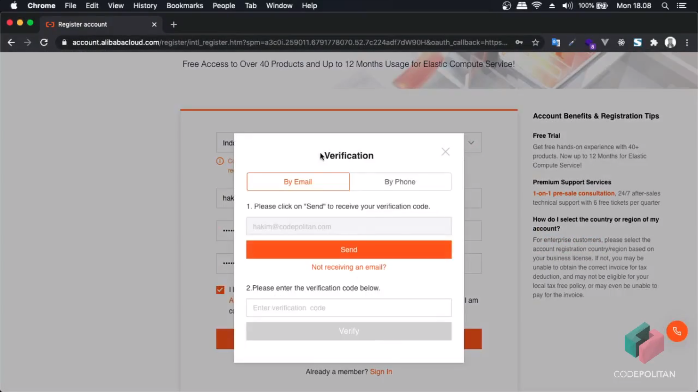
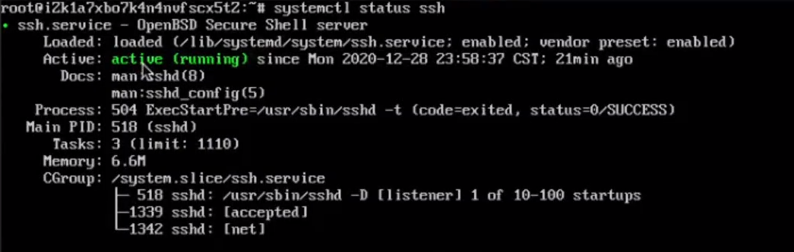

#Setting Up Server With Alibaba Cloud Elastic Compute Service
This manual how to configuration Alibaba Cloud Elastic Compute Service
##Registration
###Registration Account Alibaba Cloud
First You must have account Alibaba Cloud for create Alibaba Cloud Elastic Compute Service
[alibabacloud.com](alibabacloud.com)

Click Free Account


Then set your account registration




##Setting Up Server

###Install Server ECS

###Access Server on SSH
Before using SSH check status SSH on terminal dedicated on VNC with command
```
systemctl status ssh
```
And these is condition SSH on Server



###Install Web Server Nginx
###Configuration Virtual Host For Multi Site Nginx
###Installation DBMA MariaDB or MySQL
###Installation Multi Version of PHP, GIT and Composer
###Deploy Project Laravel into Server
###Upload Project Game Base on Web
###Instalation OS and Wordpress
###Setup SSH & Security Group
###Setup Domain & Virtual Host
###Setup Wordpress
###Upload Project Codeigniter on ECS with NGINX
